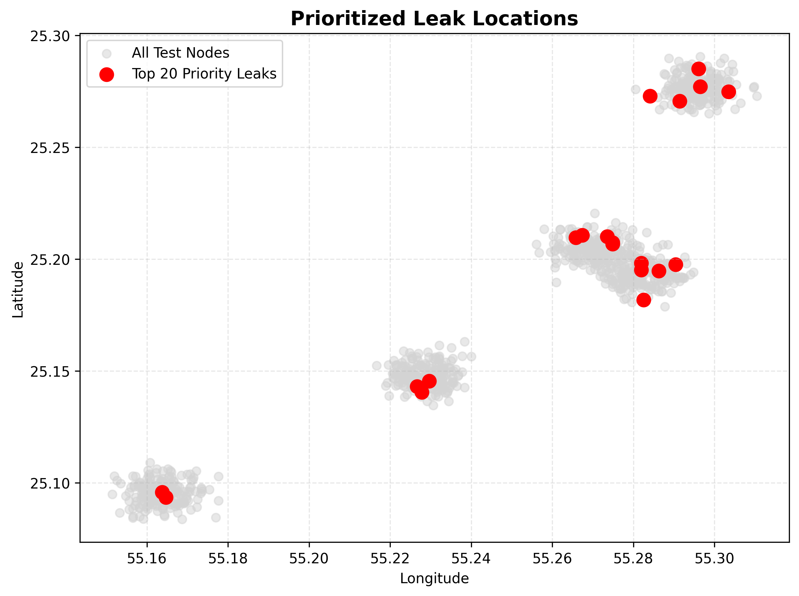
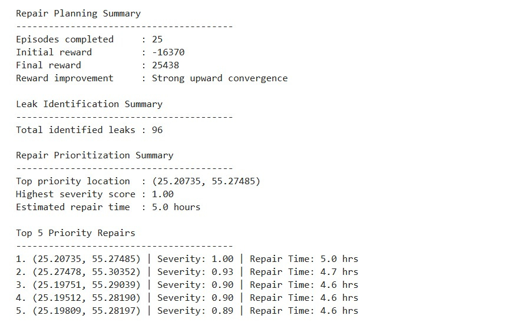

#  HydroTune

> RL-powered leak identification and repair prioritization

HydroTune is a reinforcement learning-driven decision-support system that identifies water leaks and optimizes repair prioritization.

By analyzing pressure, flow rate, and spatial location features (latitude and longitude), it models water network behavior to detect critical leak-prone locations. Beyond detection, HydroTune focuses on operational decision-making by ranking identified leaks based on severity and estimated repair effort, enabling faster and more efficient maintenance.

## ⚙️ How It Works

HydroTune uses a Deep Q-Network (DQN) to learn patterns in water system behavior and make data-driven decisions.

- Processes key inputs: Pressure, Flow Rate, Latitude, Longitude  
- Learns to distinguish leak vs non-leak conditions  
- Evaluates severity of identified locations  
- Generates a prioritized repair sequence  

## ✨ Key Highlights

- Reinforcement learning-based leak identification  
- Severity-driven prioritization of repair actions  
- Designed for real-world water network optimization  
- Focuses on decision-making, not just detection  
- Produces structured and actionable outputs  

## 🧩 Applications

- Smart water distribution systems  
- Urban infrastructure monitoring  
- Utility maintenance planning  
- Smart city resource management  

##  Tech Stack

Python · PyTorch · Deep Reinforcement Learning (DQN) · NumPy · Pandas · Scikit-learn  

## 📌 Repair Insights

HydroTune produces meaningful insights to support repair decisions:

- Identified leak locations  
- Severity score for each location  
- Estimated repair time  
- Priority ranking of repairs  

📌 Repair Summary

## 📂 Project Structure

- `src/` — implementation  
- `results/` — outputs  
